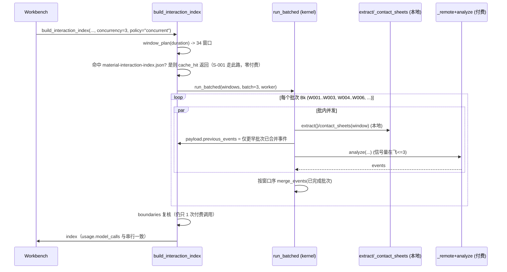
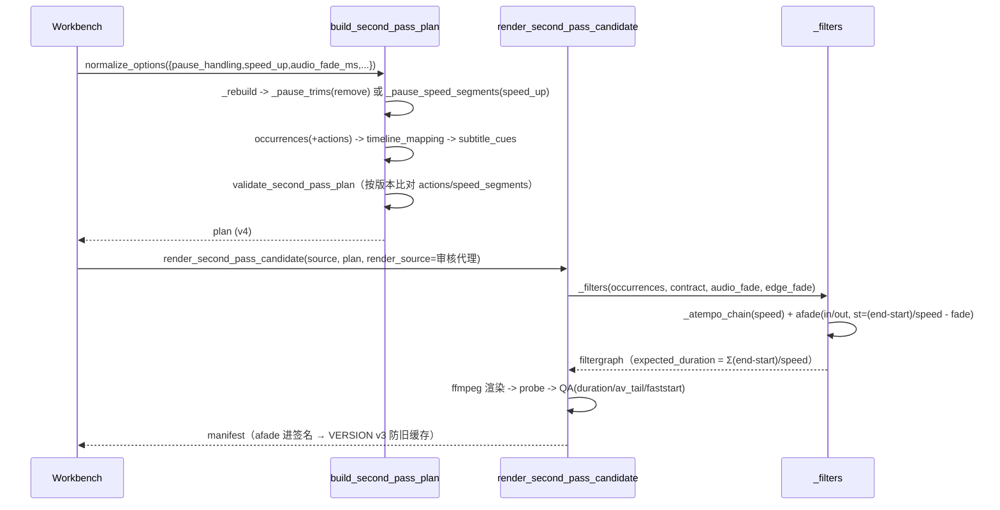
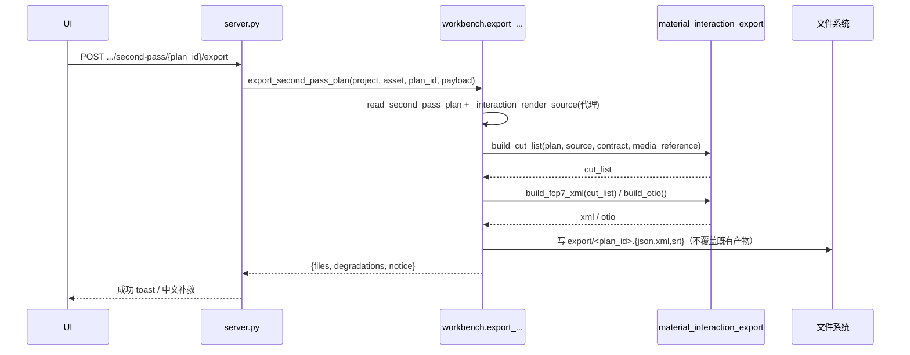
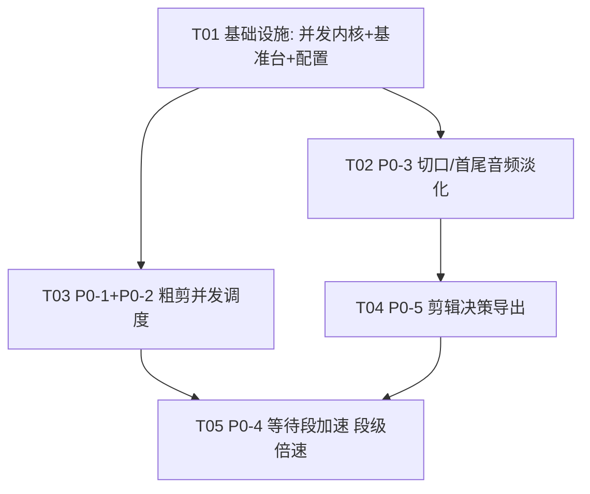

# 架构设计 + 任务分解：粗剪提速 · 二次精剪基础剪辑补全 · 剪辑决策导出（Cut V2）

- 版本：v1
- 日期：2026-09-12
- 作者：高见远（架构师）
- 上游：`docs/team-runs/2026-09-12-cut-v2/01-PRD.md`（许清楚）、`docs/ANALYSIS_AUTOEDITOR_MOVIEPY_2026-09-12_ZH-CN.md`
- 形态参考：`docs/SINGLE_DEVELOPMENT_GUIDE_MATERIAL_EVIDENCE_LAYER_V1_ZH-CN.md`、`docs/SINGLE_DEVELOPMENT_GUIDE_INTERACTION_PAUSE_RECOMMEND_V3_ZH-CN.md`
- 试点：`local-material-understanding-test` / **S-001**（88.9 分钟竖屏直播回放，34 视觉窗口 / 9 ASR 分片）
- 配套图：`docs/team-runs/2026-09-12-cut-v2/class-diagram.mermaid`、`docs/team-runs/2026-09-12-cut-v2/sequence-diagram.mermaid`

> 本文件是全量实现依据。**主理人已拍板决策 D1–D5 与追加要求 A1–A3 已全部内化，不再摇摆。**
> 硬约束 N1–N8 逐条映射到验收（见第 5 节任务与第 9 节）。

---

## 第 0 节：一句话总览

在**不动任何付费合同**的前提下做三件事：① 用**有界并发池**把「本地抽帧/联系表」和「已获授权的付费窗口/分片」并发起来，默认上限 = 1（等价现状），显式开关才提速；② 给二次精剪渲染补上**切口/首尾音频淡化**与**等待段加速（段级倍速）**两个纯 FFmpeg 原语；③ 新增**剪辑决策导出**（JSON `cut-list-v1` + FCP7 XML），并提供一个**可注入假分析器/假 ASR 的零付费基准台**来证明提速收益。**所有收益先实测再宣称（D5）。**

---

## 第 1 节：实现方案与框架选型

### 1.1 核心难点与对策

| 难点 | 本质 | 对策 |
|---|---|---|
| 窗口 N 的付费 payload 含 `previous_events`（`material_interactions.py:563`） | 并发会改变 payload → 改变 `request_signature` → 在途已付费日志作废 | **双路线合同（D1）**：默认路线甲「payload 逐字不变、付费调用串行、只并发本地部分」；`window_context_policy="concurrent"` 走路线乙「**批次屏障**（batch barrier）」——详见 1.3 |
| 34 个 S-001 窗口已命中缓存，重跑不会发生也不该发生 | 「在 S-001 上重跑测提速」= 34 次真实付费，违反 N1 | **零付费基准台（A1）**：注入假 `analyze` + 假 ASR submit，在任意窗口/分片数上量墙钟与在飞峰值；真实小样本实测只作补足（见 1.5） |
| 5 分钟验收素材 `5分钟.mp4` 大材小用 | 315s<600s → ASR 只有 1 片；≈2–3 个窗口 → 并发收益测不出 | 收益证明**不依赖**该素材：并发收益由基准台给数；该素材只用于「HEVC 走审核代理转码」「窄长比渲染契约」「切口淡化听辨」等**功能性**验收（A2） |
| `pause_speed`（1.5–4.0）不是合法倍速 | `ALLOWED_SPEEDS=(1.0,1.1,1.25)`、`_validate_occurrences` 硬校验；`_rebuild` 逐键比对派生字段 | **版本门控**：新增 `interaction-second-pass-plan-v4`，段级倍速与 `actions` 仅在 v4 生成/比对；v1/v2/v3 重建逻辑一字不改（保 N7） |
| 现渲染 `atempo` 单实例上限 2.0 | 4.0 需链式 | `_atempo_chain(speed)`：≤2.0 单实例；>2.0 拆 `2.0 × speed/2.0`（≤2 实例覆盖到 4.0），断言乘积 == speed |
| FCP7 XML 对「变速」和「HEVC/TS 源」支持参差 | 导出即对外契约 | 变速写 `Time Remap` 并记 `fcp7_speed_degraded` 降级；媒体引用**默认审核代理**（D4），可切原片并给中文警告 |
| 单机多任务：端口抢换、服务重启自动续跑（A3） | 并发实现必须继承既有安全经验 | 有界池 + 失败窗口单独重试 + 不改已完成窗口付费日志 + `ambiguous` 冻结 + **全局一键回串行**（见 1.4） |

### 1.2 并发实现选型：`concurrent.futures.ThreadPoolExecutor` + `BoundedSemaphore`

**选 ThreadPoolExecutor（线程），不选 asyncio、不选 ProcessPoolExecutor。理由：**

1. **调用图全同步**。`requests`、`subprocess.run`、`_post_vision_json`、`transcribe_audio_bytes` 全是阻塞同步调用；`server.py` 已用 `asyncio.to_thread` 把整条链路丢到线程里。改 async 要重写整条链路且无收益。
2. **工作负载是 I/O 等待为主**（等云端 HTTP 返回、等 FFmpeg 子进程）。**GIL 在 I/O 与 `subprocess` 期间被释放**，因此线程池能拿到真实并发度；本任务的并发收益来自「等网络」而非「算 CPU」。
3. **不能用多进程**：`tests/backlot` 靠 monkeypatch 注入假 `analyze`/假 `extract`/假 `transcribe_audio_bytes`；多进程会丢失补丁、并重导入重型模块，且 Windows `spawn` 开销大、跨进程共享写前日志与缓存文件句柄复杂 → 会破坏 N3 与 N1 的可验证性。
4. **有界并发**：`ThreadPoolExecutor(max_workers=limit)` 限制线程数，再叠一层 `threading.BoundedSemaphore(limit)` 作为**全局在飞上限**（跨调用点共享，防止 ASR 与视觉窗口同时放开导致本机句柄/内存峰值失控，见 A3）。
5. **信号量 vs 池**：池负责「排队与复用」，信号量负责「跨阶段全局上限」与「一键回串行」。二者都需要。
6. **不做无界 `Thread` fan-out**：34 窗口一次性开线程会在 88.9 分钟素材上把内存/句柄峰值推到不可控（PRD 风险点「并发下的内存/句柄峰值」）。

**导出模块边界**：新增**纯函数**模块 `backlot/material_interaction_export.py`，只吃「已冻结的计划字典 + 契约字典」产出「字符串/字典」，**不碰网络、不碰 FFmpeg、不改计划文件**（满足「导出零付费/零副作用」）。落盘与 HTTP 接线在 `workbench.py` / `server.py`，UI 在 `workbench.js`。

### 1.3 窗口并发双路线合同（D1，必须照此写）

统一的**批次屏障（batch barrier）**模型：设并发上限 `C = interaction_concurrency`，把窗口按 `W001, W002, ...` 切成大小 `C` 的批次 `B1, B2, ...`。

- **路线甲（`window_context_policy="serial_equivalent"`，默认）**
  - 窗口 `previous_events` 的构造**逐字保持现状**；付费 `analyze()` 调用**严格串行、严格按窗口序**（用一个全局 1-slot 锁包住「构造 payload + `_remote`」这一段）。
  - **本地部分**（`extract()` 抽帧 + `_contact_sheets()` 联系表，纯本地、只依赖 `window["times"]`、与 `events` 无关）允许并发预取到 `C` 路。
  - 结果：`C=1` 时与现状**逐字节一致**；`C=2..4` 时「本地预取」盖住部分付费等待，提速有限（<20% 量级）——**如实记录，不宣称达成 G1**。
- **路线乙（`window_context_policy="concurrent"`，显式开关）**
  - 同一批次 `Bk` 内的窗口**并发**发起付费调用；每个窗口的 `previous_events` 只取「**严格更早批次**已完成的事件（按窗口序合并）」，即批内窗口互不可见。
  - payload 因此**确定性地**与串行版不同（依赖批次边界）→ `request_signature` 变 → **只对新素材的新分析生效**。已在途/已完成的旧分析按它启动时的策略走完，**绝不因切换而作废已付费窗口**。
  - 每批 `C` 个窗口完成后，按窗口序 `merge_events` 再进下一批 → 结果**可复现**（同样的 `C` 得到同样的 payload 与合并顺序）。
  - **拒绝**「完全异步、批内互相可见」的模型：它使 payload 依赖线程完成时序 → 不可复现 → 破坏可校验性。这是本设计的明确取舍。

> **UI/preflight 铁律（写死）**：切到路线乙时必须显示中文提示「**切换到并发后，旧的在途分析不能续跑：未完成窗口将按新合同重新分析（新素材新分析适用）**」。

### 1.4 并发安全经验继承（A3）

- **有界并发池**：所有并发入口统一走 `interaction_concurrency.run_bounded`，绝无裸 `Thread()`。
- **失败窗口/分片单独重试，不改已完成窗口的付费日志**：每个窗口 `{id}-model.json` / 每个分片 `chunk-{i:05d}.json` 仍是独立、写前日志（`_remote` 语义不变）；重试只重跑失败单元。
- **`ambiguous` 仍冻结人工核对**：`[status in {submitting, ambiguous}]` → 抛 `status="ambiguous"` + 不自动重复提交（`confirm_ambiguous_not_accepted` 语义一字不改）。
- **全局一键回串行**：环境变量 `HAIKE_FORCE_SERIAL=1`（或 preflight 面板一个开关）→ `resolve_limit()` 一律返回 `1`，且 `window_context_policy` 强制回 `serial_equivalent`；**任何降级都要写进 `degradations[]` 并在界面可见**。
- **跨会话端口/续跑**：并发调度是**进程内**的，不改变「服务重启自动续跑在途任务」的既有行为；续跑仍走缓存命中（在途/已完成单元不重算）。

### 1.5 零付费基准台（A1，P0-1/P0-2 的前置）

新增 `scripts/benchmark_interaction_concurrency.py`，可注入：

- 假分析器 `fake_analyze(kind, payload, images)`：`sleep(固定延迟)` 后返回合法骨架，**不发任何网络请求**；
- 假 ASR submit：monkeypatch `backlot.tencent_asr.transcribe_audio_bytes` 与 `_cut_audio_chunk`，产出假 `task_id`；
- 假抽帧：monkeypatch `_extract_frame`。

可测量（**任意窗口数 `N` / 分片数 `M`**，含 **34 窗口 / 9 分片** 规模）：

| 指标 | 口径 |
|---|---|
| 墙钟 | `time.perf_counter()` 串行 vs 各 `C` 值 |
| 在飞峰值 | `ConcurrencyStats.in_flight_peak`（信号量持有时计数） |
| 提交/调用总次数 | 必须 == 单元数（零重复、零遗漏） |
| 加速比 | serial_wall / concurrent_wall |

**可复现命令（写进文档与结论）**：

```bash
# 零付费：34 窗口 / 9 分片，测 C=1/2/3/4 的墙钟与在飞峰值
./.venv/Scripts/python.exe scripts/benchmark_interaction_concurrency.py --windows 34 --chunks 9 --sleep-ms 120 --concurrency 1,2,3,4 --json
```

真实性补足（不进基准台）：在 `5分钟.mp4`（315.067s、HEVC 1080×2274@30fps）上跑一次**小样本真实**窗口/分片并发，量真实在飞与墙钟，与基准台的调度开销对照。**该素材测不出 ASR 并发收益（仅 1 片）与明显视觉收益（≈2–3 窗口），故其结论只用于「转码路径/渲染契约/调度开销」，不用于 G1 分母。**

---

## 第 2 节：文件清单（新增 / 修改）

> 路径均为仓库相对路径；「动作」列：**新增** / **修改**。

| # | 文件 | 动作 | 改什么（一句话） |
|---|---|---|---|
| F01 | `backlot/interaction_concurrency.py` | 新增 | 有界并发池内核：`run_bounded` / `run_batches` / `ConcurrencyStats` / `resolve_limit` / 全局一键回串行 |
| F02 | `scripts/benchmark_interaction_concurrency.py` | 新增 | 零付费基准台：注入假分析器/假 ASR/假抽帧，量墙钟与在飞峰值 |
| F03 | `tests/backlot/test_interaction_concurrency.py` | 新增 | 内核单测：上限、乱序、失败隔离、回串行、在飞峰值断言 |
| F04 | `backlot/material_interaction_second_pass_render.py` | 修改 | `_filters` 加 `afade`（切口/首尾）+ `_atempo_chain` 链式；`VERSION` 升位 |
| F05 | `backlot/material_interaction_second_pass.py` | 修改 | 选项字段（`pause_handling`/`pause_speed`/`audio_fade_ms`/`edge_fade`）、`speed_segments`/`actions`、段级倍速校验、`VERSION`→v4、版本门控 |
| F06 | `backlot/material_interaction_second_pass_candidates.py` | 修改 | 透传新选项；重渲染沿用冻结证据 |
| F07 | `backlot/tencent_asr.py` | 修改 | `_transcribe_long_file` 分片并发布局：缓存预筛 → 有界并发提交 → 按 offset 升序合并 |
| F08 | `backlot/material_interactions.py` | 修改 | 窗口并发布局：本地预取并发 + 付费调用双路线（批次屏障 / 串行锁）；**`VERSION` 与 `request_signature` 组成不变** |
| F09 | `backlot/material_interaction_export.py` | 新增 | 纯函数导出：`build_cut_list` / `build_fcp7_xml` / `build_otio` / `export_plan` |
| F10 | `backlot/workbench.py` | 修改 | 导出入口 + 新选项透传 + 进度文案「并发 C 路」+ preflight 新增「并行分析上限」「导出能力」项 |
| F11 | `backlot/server.py` | 修改 | 新增导出 HTTP 接口（`.../interactions/second-pass/{plan_id}/export`） |
| F12 | `backlot/ui/workbench.js` | 修改 | 二次剪辑面板：切口消爆音勾选、等待段处理单选+倍速下拉、导出对话框、指标行、进度文案 |
| F13 | `tests/backlot/test_material_interaction_second_pass_render.py` | 修改 | `afade` 断言、时长不变、关掉开关逐字一致、`atempo` 链式 |
| F14 | `tests/backlot/test_material_interaction_second_pass.py` | 修改 | 段级倍速、`pause_handling` 互斥、`actions` 版本门控、v1/v2/v3 可读 |
| F15 | `tests/backlot/test_tencent_asr_long_audio.py` | 修改 | 分片并发：在飞 ≤ 上限、提交次数 == 分片数、二次运行 0 提交、乱序返回正确合并 |
| F16 | `tests/backlot/test_material_interactions.py` | 修改 | 窗口并发：在飞 ≤ 上限、窗口数/调用数不变、`C=1` 逐字一致、失败窗口单独重试 |
| F17 | `tests/backlot/test_material_interaction_export.py` | 新增 | JSON/XML 合法性、字段覆盖、帧号单调、时长守恒、**零覆盖（每次导出生成新文件、按内容哈希命名，除生成时间字段外内容一致）**、零副作用 |
| F18 | `docs/handoff/CURRENT_STATUS.md`、`docs/handoff/CODE_MAP.md` | 修改 | 交接：新模块、新版计划、并发契约、导出能力 |

---

## 第 3 节：数据结构与接口（工程师照此写）

### 3.1 计划层新选项字段（`material_interaction_second_pass.py::normalize_options`）

| 字段名 | 类型 | 默认 | 取值域 | 说明 |
|---|---|---|---|---|
| `pause_handling` | str | `"remove"` | `{"remove","speed_up","off"}` | D2：默认 `remove`（保 V3 行为）；`speed_up` 由用户勾选；`off` 不处理 |
| `pause_speed` | float | `2.0` | `[1.5, 4.0]`（步进允许 1.5/2.0/3.0/4.0） | 仅 `pause_handling="speed_up"` 生效 |
| `audio_fade` | bool | `True` | — | 「切口消爆音」开关；关掉时滤镜串与现状逐字一致 |
| `audio_fade_ms` | float | `8.0` | `[5.0, 15.0]` | 每个接缝 `afade` 时长；越界报中文错误 |
| `edge_fade` | bool | `False` | — | 整片首尾淡化（P1-3）开关 |
| `edge_fade_ms` | float | `200.0` | `[150.0, 300.0]` | 整片首尾淡化时长（仅 `edge_fade=True`） |
| `pause_margin_head_seconds` | float\|None | `None` | `[0.0, 0.5]` | P1-3 非对称留白（`None` → 沿用对称 `pause_guard_seconds`） |
| `pause_margin_tail_seconds` | float\|None | `None` | `[0.0, 0.5]` | 同上 |
| `window_context_policy` | str | `"serial_equivalent"` | `{"serial_equivalent","concurrent"}` | D1 双路线；只影响**粗剪分析**，不进二次精剪渲染签名 |
| `interaction_concurrency` | int | `1` | `[1, 4]` | 视觉窗口并发上限（默认 1 = 现状） |
| `asr_concurrency` | int | `3` | `[1, 4]` | ASR 分片并发上限 |

**互斥规则（`normalize_options` 强校验，中文报错）**：
- `pause_handling != "remove"` ⇒ 自动把 `compress_pauses` 置 `False`；若用户**同时显式**传 `compress_pauses=True` 与 `pause_handling in {"speed_up","off"}` → 抛 `InteractionSecondPassError("「快放等待段」与「压缩对话间停顿」互斥，不能对同一段既删又快放")`。
- `audio_fade=False` ⇒ 即使 `audio_fade_ms` 越界也不报错（视为未启用）；`audio_fade=True` 时越界才报 `"切口淡化时长需在 5–15 毫秒之间"`。

### 3.2 段级倍速的表达（P0-4，按动作模型写，为 P2-1 留接口）

`occurrences` 每个元素结构（v4 起）：

```json
{
  "occurrence_id": "O-BODY-002",
  "role": "body",
  "group_ids": ["G1"],
  "source_start": 30.0,
  "source_end": 42.5,
  "speed": 2.0,
  "actions": [
    { "kind": "speed", "value": 2.0, "unit": "ratio", "reason": "waiting_segment" }
  ]
}
```

**动作模型规范（逐字照用）**：

| 字段 | 类型 | 取值 | 说明 |
|---|---|---|---|
| `kind` | str | `"speed"` | 本次仅 `speed`；P2-1 预留 `volume`/`duck`/`ease` |
| `value` | number | 倍率 | `unit="ratio"` 时为正浮点（1.5–4.0 或 1.0/1.1/1.25） |
| `unit` | str | `"ratio"` | 本轮唯一合法值；P2-1 预留 `"seconds"`/`"frames"` |
| `reason` | str | 中文短串 | `"waiting_segment"`（等待段）/ `"preset"`（整体倍速）/ `"segment_override"` |

**段级倍速 vs 整体倍速的优先级规则（写死）**：
1. `options.speed`（整体，1.0/1.1/1.25）是**默认倍率**，作用于未显式覆盖的 occurrence。
2. **段级 `actions` 中的 speed 覆盖整体倍率，不与整体倍率相乘**（等待段倍速是**绝对倍率**，保证「输出时长 == (end-start)/pause_speed」可预测，满足 N6 与 P0-4 验收③）。
3. 已解析的 `occurrence.speed`（浮点）= 渲染层唯一读的字段；`actions` 是**可解释的派生视图**，P2-1 再把它升级为一等。

**版本门控（保 N7 的关键）**：
- `VERSION = "interaction-second-pass-plan-v4"`；`SUPPORTED_VERSIONS = {v1, v2, v3, v4}`。
- `ACTION_AWARE_VERSIONS = {v4}`、`SPEED_SEGMENT_AWARE_VERSIONS = {v4}`。
- `_rebuild` 仅在 `version in ACTION_AWARE_VERSIONS` 时给 occurrence 加 `actions`、仅在 `SPEED_SEGMENT_AWARE_VERSIONS` 时产出 `speed_segments`；`validate_second_pass_plan` 的 `compare_keys` **按版本追加** `actions`/`speed_segments`。**v1/v2/v3 的重建路径一字不改**，否则旧计划读取即报「与语义选择不一致」。

### 3.3 `speed_up` 段的派生字段（`_rebuild` 新逻辑）

新增派生字段 **`speed_segments`**（与 `pause_trims` 同级）：

```json
[{
  "segment_id": "SS001",
  "occurrence_id": "O-BODY-002",
  "role": "body",
  "silence_start": 33.2, "silence_end": 41.8,
  "source_start": 33.4, "source_end": 41.6,
  "speed": 2.0, "unit": "ratio",
  "reason": "VAD 与静音探测双重确认的等待段；快放而非删除"
}]
```

- `pause_handling="speed_up"`：`_pause_trims` **不产出**（`pause_trims=[]`），改由 `_pause_speed_segments(...)` 产出 `speed_segments`；`_apply_pause_trims` 扩展为通用 `_apply_segments`，把等待区间**切出来**成为独立 occurrence，其 `speed = pause_speed` 且带 `actions[{kind:"speed",value:pause_speed,unit:"ratio",reason:"waiting_segment"}]`。
- 三重许可（VAD 不相交 / `silencedetect` 真静音 / 单条够长）与 `guard`/`gap` 计算**复用现有 `_pause_trims` 逻辑**，只把「删除」换成「快放」。
- `pause_handling="off"`：`pause_trims=[]` 且 `speed_segments=[]`。
- 时长守恒：`output_duration == Σ (source_end - source_start)/speed`（±1ms）；`speed_up` 版**源片重复 = 0、无删剪跳切**。

### 3.4 `pause_handling` 段级倍速对校验的影响

- `_validate_occurrences` 的合法倍速集合按版本放行：v4 = `{1.0,1.1,1.25} ∪ [1.5,4.0]`；v1/v2/v3 保持 `ALLOWED_SPEEDS`。
- 新增 `_validate_speed_segments(speed_segments, allowed, speech_ranges)`：等待段必须落在 `allowed` 内、`speed == options.pause_speed`、**不与 VAD 语音帧相交**、区间非空；违者抛中文 `InteractionSecondPassError`。
- `content_qa` 仍然只判**上限**（快放只会变短，不触发 `needs_adjustment`）。

### 3.5 渲染层接口

```python
# material_interaction_second_pass_render.py
def _atempo_chain(speed: float) -> str:
    """倍率 >2.0 时链式：4.0 -> 'atempo=2.0,atempo=2.0'。"""

def _segment_audio_filters(start, end, speed, *, audio_fade, audio_fade_ms) -> str:
    """atrim,asetpts,aresample,aformat,<atempo链>,afade in/out。
    fade-out 的 st = (end-start)/speed - fade（变速后时间轴），绝不改总时长。"""

VERSION = "interaction-second-pass-render-v3"   # v2 -> v3（afade 进签名）
```

> **实现偏差（已裁决，覆盖上方 `_atempo_chain` 链式）**：实现为单实例 `atempo`，偏离原链式要求；理由：项目固定的 static-ffmpeg 8.0.1 实测支持 **[0.5,100]**，`pause_speed` 上限 4.0，链式属无谓复杂度。越界抛中文可执行错误。详见 §8.3。

`_filters(occurrences, contract, has_audio, subtitle_filter="", *, audio_fade=True, audio_fade_ms=8.0, edge_fade=False, edge_fade_ms=200.0)`：
- 每段音频：`[0:a]atrim=...:asetpts=...:aresample=48000:async=0:first_pts=0:aformat=...:atempo链:afade=t=in:st=0:d=..:afade=t=out:st=(dur-fade):d=..[a{i}]`。
- 整片首尾（`edge_fade=True`）：在 `[acat]` 后 `afade=t=in:st=0:d=edge`、`afade=t=out:st=(total-edge):d=edge`。
- **关掉 `audio_fade` 且 `edge_fade=False` 时，音频滤镜串与此前逐字一致**（等价性保护，P0-3 验收③）。
- 视频不变；`tpad` 覆盖逻辑保留。

### 3.6 导出接口（`material_interaction_export.py`，纯函数）

```python
SCHEMA_NAME = "cut-list-v1"; SCHEMA_VERSION = 1
FRAME_ROUNDING = "round_half_up"

def build_cut_list(plan, *, source, contract, media_reference, generated_at=None) -> dict: ...
def build_fcp7_xml(cut_list) -> str: ...
def build_otio(cut_list) -> dict: ...            # P1-1，手写 .otio JSON
def export_plan(plan, *, output_dir, formats, media_reference, include_srt=False,
                include_clips=False, source=None, contract=None) -> dict: ...
```

**`cut-list-v1` JSON schema（精确字段）**：

```json
{
  "schema": "cut-list-v1",
  "schema_version": 1,
  "generated_at": "2026-09-12T10:00:00+00:00",
  "generator": {"name": "haike_video", "module": "material_interaction_export", "version": "cut-list-v1"},
  "plan": {"plan_id": "ISP-...", "revision": 3, "status": "pending_review", "created_at": "..."},
  "approved": false,
  "source": {
    "fingerprint": "<sha256>",
    "original": {"path": "artifacts/media-index/S-001/<原片>.mp4",
                 "codec": "hevc", "container": "mpegts", "r_frame_rate": "90000/1",
                 "note": "Premiere 很可能无法直接打开（HEVC + TS，时间戳可能断裂）"},
    "reference": {"kind": "review_proxy", "path": "artifacts/.../review.mp4", "fingerprint": "<sha256>"}
  },
  "contract": {"fps": 30.0, "width": 1080, "height": 2274,
               "audio": {"sample_rate": 48000, "channels": 2}},
  "timeline": {"output_duration": 53.7, "frame_count": 1611, "timebase": 30},
  "segments": [{
    "segment_id": "O-BODY-001",
    "role": "body", "group_ids": ["G1"],
    "source_start": 12.5, "source_end": 20.0, "speed": 1.1,
    "actions": [{"kind": "speed", "value": 1.1, "unit": "ratio", "reason": "preset"}],
    "output_start": 0.0, "output_end": 6.818181,
    "source_start_frame": 375, "source_end_frame": 600,
    "output_start_frame": 0, "output_end_frame": 205
  }],
  "subtitles": [{"cue_id": "O-BODY-001:U00003", "output_start": 1.2, "output_end": 3.4, "text": "…"}],
  "pause_handling": "remove",
  "pause_trims": [],
  "speed_segments": [],
  "degradations": [],
  "warnings": [],
  "media_reference_policy": "review_proxy",
  "frame_rounding": "round_half_up"
}
```

**FCP7 XML（`xmeml` v4）结构要点**：

```
<xmeml version="4">
  <sequence>
    <name>ISP-...</name>
    <duration>1611</duration>
    <rate><timebase>30</timebase><ntsc>FALSE</ntsc></rate>
    <media>
      <video>
        <format><samplecharacteristics><width>1080</width><height>2274</height></samplecharacteristics></format>
        <track>
          <clipitem id="clipitem-1">
            <name>O-BODY-001</name><enabled>TRUE</enabled>
            <start>0</start><end>205</end><in>375</in><out>600</out>     <!-- 全部为帧号 -->
            <rate><timebase>30</timebase><ntsc>FALSE</ntsc></rate>
            <file id="file-1">
              <name>review.mp4</name>
              <pathurl>file://localhost/…/review.mp4</pathurl>
              <rate><timebase>30</timebase></rate>
              <duration>…</duration>
              <media><video>…</video></media>
            </file>
            <!-- speed != 1.0 时：Time Remap 效果 + 记录降级 -->
            <filter><effect><name>Time Remap</name><effectid>timeremap</effectid>
              <parameter><parameterid>speed</parameterid><value>110</value></parameter>
            </effect></filter>
          </clipitem>
          <!-- 字幕：时间线标记 -->
          <generatoritem id="g1"><name>Titles</name><rate><timebase>30</timebase></rate>
            <in>-1</in><out>-1</out><duration>1</duration><media>…</media>
            <marker><comment>字幕文本</comment><in>36</in><out>102</out></marker>
          </generatoritem>
        </track>
      </video>
    </media>
  </sequence>
</xmeml>
```

**帧号规则**：`frame = floor(seconds * fps + 0.5)`（round_half_up）；段边界帧号**单调不减**；任一帧号 `∈ [0, source_frame_count]`，越界即 `InteractionExportError`（中文）。**变速退化策略**：优先写 `Time Remap`；一旦目标软件不支持，退化为「等长片段 + 标记」并写 `degradations += ["fcp7_speed_degraded:<segment_id>"]`。字幕同时导出旁挂 SRT。

**导出路径**：`projects/<项目>/artifacts/media-index/<资产>/interaction-second-pass/<plan_id>/export/<plan_id>.{json,xml}`，**不覆盖任何既有产物**。

### 3.7 导出 REST 接口（`server.py`）

```
POST /api/project/{project_id}/workbench/assets/{asset_id}/media-index/interactions/second-pass/{plan_id}/export
body: { "formats": ["json","fcp7_xml"], "media_reference": "review_proxy|original",
        "include_srt": false, "include_clips": false, "confirmed": true }
resp: { "files": [{"format":"json","path":"…"}], "degradations": [], "notice": "此计划尚未确认入库" }
```

失败映射为中文可执行补救，例如：`"导出失败：原片/代理文件路径不存在，请先在素材面板确认审核代理已生成，然后重新导出。"`

---

## 第 4 节：程序调用流程

### 4.1 粗剪窗口并发（路线乙示例，`window_context_policy="concurrent"`, C=3）



### 4.2 二次精剪生成 + 渲染（含 `speed_up` 与 `afade`）



### 4.3 导出



---

## 第 5 节：任务列表（有序 · 含依赖 · 按实现顺序）

> **落地顺序严格遵循 PRD §5.3：P0-3 → P0-1 → P0-2 → P0-5 → P0-4。** A1 基准台作为 T03（P0-1/P0-2）的**前置**，落在 T01。
> 每个任务 ≥3 个文件；第一个任务 = 项目基础设施（并发内核 + 基准台 + 配置 + 入口）。

| 任务 | 名称 | 目标文件 | 依赖 | 优先级 | 验收方式 | 复杂度 |
|---|---|---|---|---|---|---|
| **T01** | **基础设施：并发内核 + 零付费基准台 + 配置键** | F01 `backlot/interaction_concurrency.py`（新）、F02 `scripts/benchmark_interaction_concurrency.py`（新）、F03 `tests/backlot/test_interaction_concurrency.py`（新）、F10 的配置键段 | 无 | P0 | ★A1 基准台在 34 窗口/9 分片上量出墙钟与在飞峰值（零付费）；内核单测断言「在飞 ≤ 上限」「乱序返回保序」「失败隔离」「`HAIKE_FORCE_SERIAL=1` 回串行」；`pytest tests/backlot/test_interaction_concurrency.py -q` 全绿 | 中 |
| **T02** | **P0-3 精剪基础剪辑：切口/首尾音频淡化（+P1-3 非对称留白）** | F04 `material_interaction_second_pass_render.py`、F05 `material_interaction_second_pass.py`、F13 渲染测试、F12 勾选 | T01 | P0 | 每段含一对 `afade` 且 `st` 按变速后时长；关掉开关滤镜串与现状逐字一致；越界报中文；`ffprobe` 输出时长不变到 1ms；R0007 重渲染 QA `passed`；独立脚本测 26 接缝样本级不连续显著下降；`VERSION` 升位 | 中 |
| **T03** | **P0-1 + P0-2 粗剪并发调度（ASR 分片 + 视觉窗口）** | F07 `tencent_asr.py`、F08 `material_interactions.py`、F10 进度/preflight、F12 状态行、F15 ASR 测试、F16 窗口测试 | T01（A1 基准台前置） | P0 | 分片：分片数不变、提交次数 == 分片数、二次运行 0 提交、按 offset 合并逐字节一致、`429` 退避非致命；窗口：`usage.model_calls == 35`、窗口数不变、`C=1` 与现状逐字节一致、乱序返回正确 merge、失败窗口单独重试、`ambiguous` 冻结、`material-interaction-index.json` **sha256 不变**；基线与收益由基准台 + 真实小样本记录（D5） | 高 |
| **T04** | **P0-5 剪辑决策导出（JSON `cut-list-v1` + FCP7 XML）** | F09 `material_interaction_export.py`（新）、F10 导出入口、F11 `server.py`、F12 导出对话框、F17 导出测试 | T02（需要新渲染语义/字段就位） | P0 | JSON 能被本模块读回、覆盖全部 `timeline_mapping`、`Σ(output)==output_duration`；XML 合法、`timebase==fps`、帧号为整数且单调且不越界；导出幂等；导出前后 `plan` 哈希不变、零付费；未入库计划也能导出并标注；人工在 Premiere/达芬奇成功导入 ≥1 次 | 中 |
| **T05** | **P0-4 等待段加速（段级倍速动作模型）+ P2-1 数据契约草案** | F05 `material_interaction_second_pass.py`、F04 渲染 `atempo` 链式、F06 透传、F12 单选+倍速下拉、F14 计划测试、F13 渲染测试 | T03、T04 | P0（P2-1 仅草案） | `speed_up` 下 `speed_segments` 非空、`pause_trims` 为空、校验接受段级倍速；`atempo=4.0` 链式且乘积 4.0±1e-6；输出时长 == Σ(end-start)/speed（±1ms）；字幕 `output_*` 单调且 ∈[0,duration]；R0007 各跑 `remove`/`speed_up` 均 ≤60s、QA `passed`、`speed_up` 源片重复=0、无跳切；UI 三选一与「压缩停顿」互斥即时可见；v1/v2/v3 计划仍可读 | 中 |

**任务依赖图**



> **说明**：① `A1 基准台` 在 T01 交付，是 T03 的前置（T03 声明依赖 T01 即涵盖）；② T04 依赖 T02（导出需读写 `audio_fade`/新渲染签名等新字段与版本）；③ T05 同时依赖 T03（并发已就位、主链路稳定）与 T04（导出契约已定，段级倍速字段可被导出一致表达）；④ **任务间不构成长线性链**：T02 与 T03 均只依赖 T01，可并行推进。

---

## 第 6 节：依赖包列表

**无新增第三方包（D3）。**

| 能力 | 依赖 | 结论 |
|---|---|---|
| 并发 | Python 标准库 `concurrent.futures` + `threading` | 无需新增 |
| 音频淡化 / 倍速链 | 现有 static-ffmpeg 8.0.1（`afade` / `atempo` 均为内建滤镜） | 无需新增 |
| JSON cut-list | 标准库 `json` | 无需新增 |
| FCP7 XML | 标准库 `xml.etree.ElementTree`（生成）/ `xml.dom.minidom`（缩进） | 无需新增 |
| OTIO（P1-1） | **不新增** `opentimelineio`；**手写 `.otio` JSON**（OTIO 是纯 JSON schema） | 无新增；风险：手写 schema 易漏必填字段 → 列为 P1，不阻塞 P0 |

> 若确需引入 `opentimelineio`，必须单独评审预算与 `tests/backlot` 影响，**本设计不采用**。

---

## 第 7 节：共享知识（跨文件约定）

1. **命名**：
   - 并发内核：模块 `backlot/interaction_concurrency.py`；函数 `run_bounded` / `run_batches`；类 `ConcurrencyStats`；异常 `InteractionConcurrencyError`。
   - 计划版本：`interaction-second-pass-plan-v4`（`VERSION`）、`SUPPORTED_VERSIONS={v1,v2,v3,v4}`；渲染版本 `interaction-second-pass-render-v3`。
   - 导出：模块 `material_interaction_export.py`；schema `cut-list-v1`；异常 `InteractionExportError`。
   - 新字段名（**严禁改名**）：`pause_handling` / `pause_speed` / `audio_fade` / `audio_fade_ms` / `edge_fade` / `edge_fade_ms` / `pause_margin_head_seconds` / `pause_margin_tail_seconds` / `window_context_policy` / `interaction_concurrency` / `asr_concurrency` / `speed_segments` / `actions[{kind,value,unit,reason}]`。
2. **错误信息语言**：所有面向用户文案**全中文**，且**必须含可执行补救动作**（例：「并发已降为 1 路：检测到识别服务限流，请稍后重试或在设置里把并发上限调低。」「切口淡化时长需在 5–15 毫秒之间，请调整后重试。」）。禁止只给错误码或英文枚举。
3. **`VERSION` 升位规则**：
   - 改**渲染产物**（滤镜串、签名组成）→ 升 `material_interaction_second_pass_render.VERSION`（v2→v3）。
   - 改**计划语义/派生字段** → 升 `material_interaction_second_pass.VERSION`（v3→v4）。
   - **绝不升** `material_interactions.VERSION`（`outdoor-interaction-v1`）——它进 `interaction_run_directory` 与索引 `signature`，一升即触发 34 个窗口重算 = 34 次付费（违反 N2）。并发旋钮**不得**进入该签名。
4. **并发上限的配置键名**：
   - 计划内（二次精剪不需要；粗剪分析用）：粗剪入口参数 `asr_concurrency`（默认 3）、`interaction_concurrency`（默认 1）、`window_context_policy`（默认 `serial_equivalent`）。
   - 进程级覆盖：环境变量 `HAIKE_ASR_CONCURRENCY` / `HAIKE_INTERACTION_CONCURRENCY`；一键回串行 `HAIKE_FORCE_SERIAL=1`。
   - 内部常量：`DEFAULT_ASR_CONCURRENCY=3`、`DEFAULT_INTERACTION_CONCURRENCY=1`、`MAX_CONCURRENCY=4`。
5. **降级契约**：任何降级写入 `degradations[]` 且界面可见；命名 `<领域>_<原因>`（如 `pause_compression_disabled:…`、`speed_up_disabled:…`、`fcp7_speed_degraded:<segment_id>`、`proxy_missing:…`）。
6. **测试注入约定**：一切并发/付费边界用**注入假分析器/假 ASR/假 ffmpeg runner**；只有端到端验收才真调一次；基准台**永不**发网络请求。
7. **环境铁律（N5）**：一律 `./.venv/Scripts/python.exe`；FFmpeg 固定 `.venv/Lib/site-packages/static_ffmpeg/bin/win32/`；**不用 `rm`**；代码一律 `-fps_mode`，**不用 `-vsync`**；`cmd_serve` 无热重载，改代码必须重启工作台。

---

## 第 8 节：待明确事项（只列真正阻塞实现的）

1. **FCP7 变速表达的目标软件兼容性**：Premiere/达芬奇对 `Time Remap` 的导入是否可接受，还是必须退化为「等长片段 + 标记」？——**不阻塞**（两条路径都实现并记降级），但**决定 T04 人工导入验收的判据**，需人工在 Premiere 试一次后回写结论。
2. **路线乙并发上限的 provider 限流边界**：视觉/腾讯 ASR 的 QPS 限制未给定权威数字；T03 需在真实小样本上实测 `C=3/4` 是否触发 429，据此确认默认值。——**不阻塞**（默认保守：视觉 1 / ASR 3 + 退避重试）。
3. **`atempo` 单实例上限**：PRD 断言「单实例上限 2.0」，而本机 static-ffmpeg 8.0.1 实际支持 0.5–100。本设计原拟**照 PRD 链式**（4.0 → `atempo=2,atempo=2`）——链式无害且乘积精确，**不阻塞**。**已裁决（主理人）**：实现为**单实例 `atempo`，偏离原链式要求**；理由：项目固定的 static-ffmpeg 8.0.1 实测支持 **[0.5,100]**，`pause_speed` 上限 4.0，链式属无谓复杂度。**验收判据以「单实例且乘积精确、越界抛中文可执行错误」为准**（不再要求 >2.0 必须链式）。

---

## 第 9 节：硬约束映射（N1–N8 逐条落地）

| 约束 | 落地设计 | 验收锚点 |
|---|---|---|
| N1 不新增计划外付费 | 基准台零付费；窗口付费调用串行（甲）或批次屏障（乙，仅新分析）；`usage.model_calls` 公式不变 | T03：`model_calls==35`；基准台 0 网络 |
| N2 索引 sha256 不变 / 52 文件守护 | `material_interactions.VERSION` 与 `request_signature` 组成不变；并发旋钮不进签名；S-001 命中缓存提前返回 | T03：改动前后索引 sha256 不变 |
| N3 1334 项保持 0 失败 | 版本门控保旧计划可读；所有并发边界用注入假件 | 每个任务后 `pytest tests/backlot -q` ≥1334 / 0 失败 |
| N4 中文文案 + 可执行补救 | 所有新错误/降级文案中文含补救；单测断言 | T02/T04/T05 文案单测 |
| N5 Windows 铁律 | 全流程用 `.venv`/static-ffmpeg/`-fps_mode`/不用 `rm` | 全部任务的命令与代码审查 |
| N6 音频是主时钟 | `output_duration == Σ(end-start)/speed`；`afade` 不改时长；`tpad` 覆盖画面 | T02/T05 时长断言；导出 `Σ(output)==output_duration` |
| N7 历史计划可读 | `SUPPORTED_VERSIONS={v1,v2,v3,v4}`；`actions`/`speed_segments` 版本门控 | T05：v1/v2/v3 计划读取用例 |
| N8 默认保守 + 一键回串行 | 视觉默认 1 / ASR 默认 3；`HAIKE_FORCE_SERIAL=1` | T01/T03：回串行用例 |

---

## 第 10 节：最可能返工的一条设计（预判）

**第 3.2 节的「`actions`/`speed_segments` 版本门控」最可能返工。** 原因：`validate_second_pass_plan` 用「重算并逐键比对」保证一致性（`_rebuild`），一旦给 v4 的 occurrence 加了 `actions`、给计划加了 `speed_segments`，**若门控条件写错（把 v4 的比对条件套到 v3）**，所有已落盘的 v1/v2/v3 计划会立刻以「与语义选择不一致」失败 → 直接违反 N7 并污染回归。缓解：门控集合定义为显式常量（`ACTION_AWARE_VERSIONS` / `SPEED_SEGMENT_AWARE_VERSIONS`），`compare_keys` **按版本追加**，并为 v1/v2/v3 各留一条「读取即通过」的回归用例。
